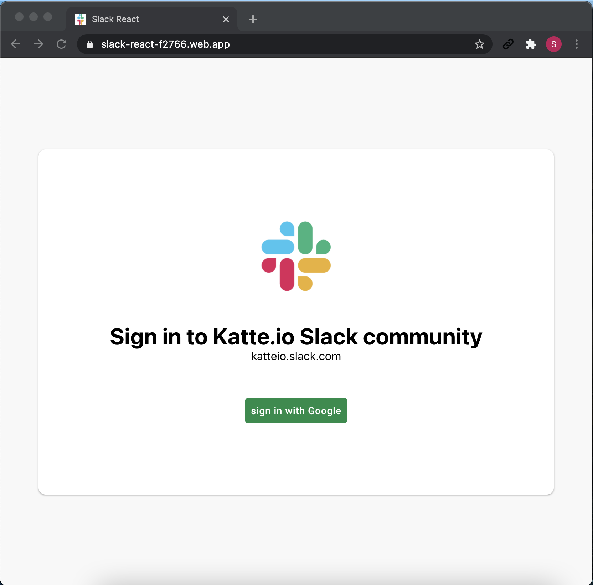
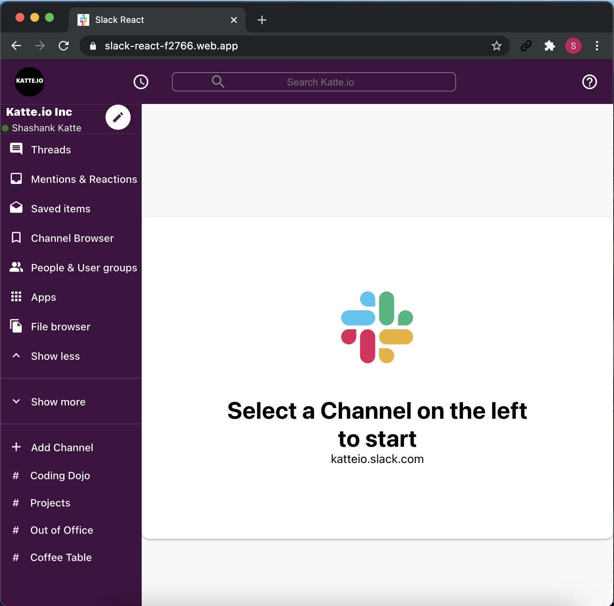
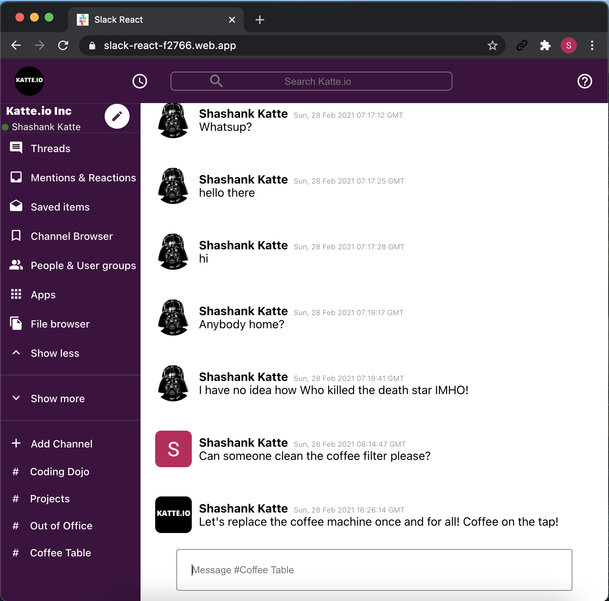

# Slack React 

A Social collaboration messaging App that looks a lot like and works like Slack! ( Slack clone... ok.. There I said it!)

## Live link
[Try Here](https://slack-react-f2766.web.app/)

## Getting Started

Clone this repo with git clone
`$ git clone git@github.com:shashankkatte/slack-react.git`

Install packaged and dependencies
`$ npm install`

Start the App
`$ npm Start`

> Feel free to use Yarn instead of npm

## Built on

* React
* Redux
* Styled Components
* Firebase hooks

## Screen shots

# How to contribute
Please feel free to fork this repo and raise pull requests for your changes. 
